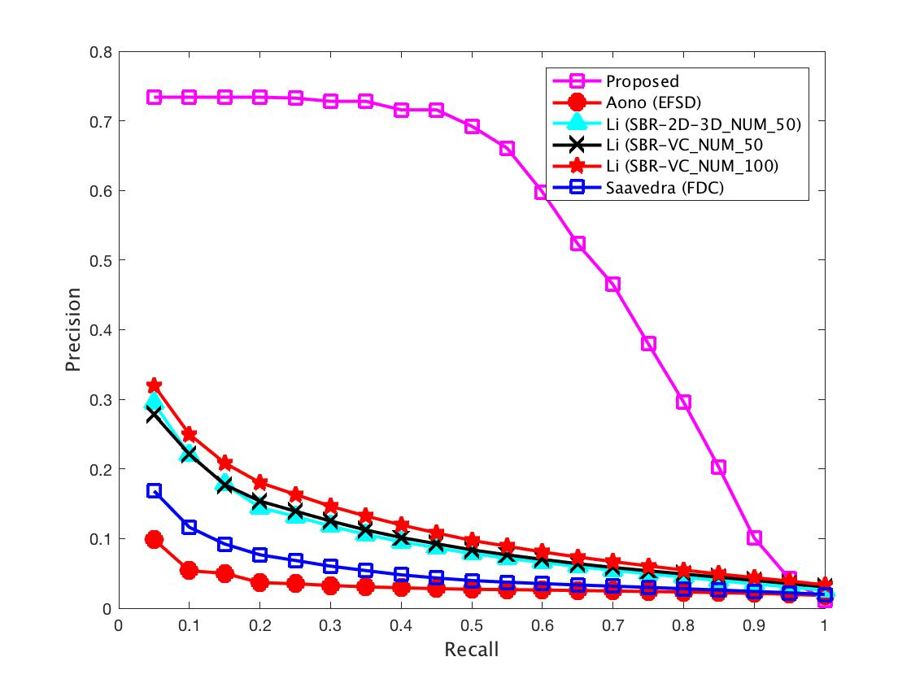
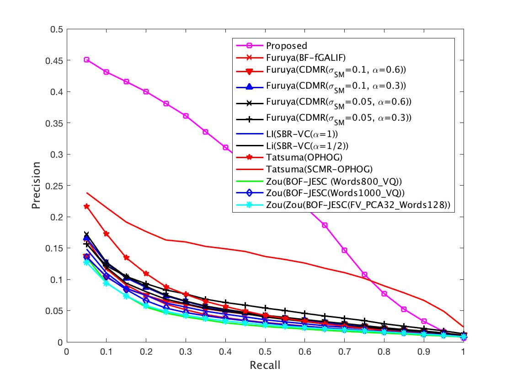

# sketchShapeDataAndResult

## Download data
1. run `chmod +x download.sh` to change file mode 
2. run `./download.sh`. This script will download shrec13 and shrec14 into **dataset** folder, also download the retrieval result to **returnList** folder.
    1. run `cd dataset` to enter the **dataset** directory
    2. run `tar -xvf *tar` to extract shrec13 and shrec14 dataset.
    3. run `cd ../returnList` to enter the **returnList** folder.
    4. run `tar -xvf *tar` to extract the retrieval list.

## Plot result (MATLAB)
run `plot13` to plot precision-recall curve for shrec13.

run `plot14` to plot precision-recall curve for shrec14.

